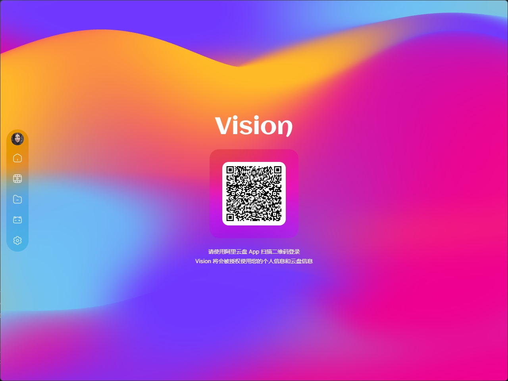

# Vision

An Alipan third party desktop application with better experience.

## 👋🏻 WIP



## 👽 TODO

- [ ] Recator code
- [ ] Render folders and files
- [ ] Video player
- [ ] Settings view
- [ ] Search files

## ⚡️ Development

```bash
$ git clone this repo
$ cd the repo
$ pnpm install
$ pnpm dev -w
```

## 📦 Build

> \[!IMPORTANT]
>
> No testing was carried out at this stage.

```bash
$ git clone this repo
$ cd the repo
$ pnpm install

# For windows
$ pnpm build:win

# For macOS
$ pnpm build:mac

# For Linux
$ pnpm build:linux

```

## 📃 License

MIT © [ppxb](./LICENSE)
