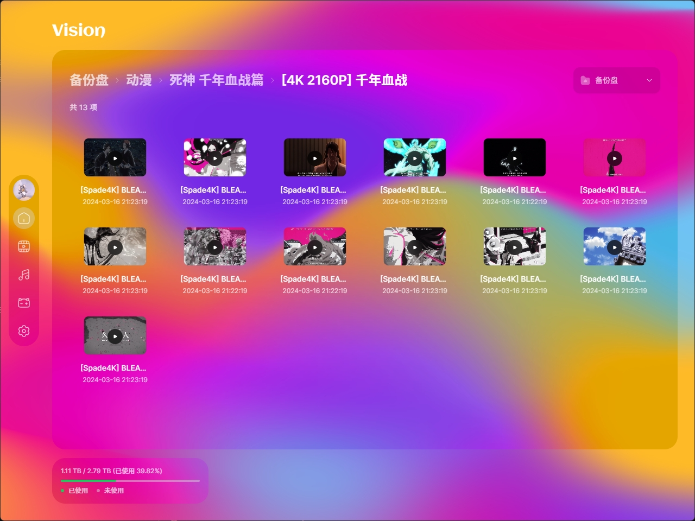

# Vision

一款高颜值的跨平台阿里云盘第三方客户端，完全使用原生阿里云盘 OpenAPI 实现。

> \[!IMPORTANT]
>
> 积极开发中，现阶段请勿使用。

## 👋🏻 WIP



## 👽 TODO

- [ ] Refator code
- [x] Render folders and files
- [x] Breadcrumb component
- [ ] Media view
- [ ] Media player (include video and music)
- [ ] Settings view
- [ ] Source view or not (included in home view)
- [ ] Search files
- [ ] UI improvements
- [ ] UX animations
- [ ] Bug fix

## ⚡️ Development

```bash
$ git clone this repo
$ cd the repo
$ pnpm install
$ pnpm dev -w
```

## 📦 Build

> \[!IMPORTANT]
>
> 现阶段未做任何测试。

```bash
$ git clone this repo
$ cd the repo
$ pnpm install

# For windows
$ pnpm build:win

# For macOS
$ pnpm build:mac

# For Linux
$ pnpm build:linux

```

## 📃 License

MIT © [ppxb](./LICENSE)
